# IF3210-2024-Android-PPL

## BondoMan
Aplikasi BondoMan merupakan sebuah aplikasi yang bertujuan untuk memudahkan pengguna dalam merangkum pendapatan dan pengeluaran keuangan. Selain mencatat pengeluaran dan pemasukan, aplikasi ini juga dapat menampilkan graph tentang perbandingan pengeluaran dan pemasukan pengguna. Aplikasi ini juga dapat menambahkan transaksi secara otomatis melalui fitur scan nota. Laporan pemasukan dan keuangan juga dapat di simpan dalam bentuk .xls maupun .xlsx yang kemudian dapat di simpan maupun dikirim ke email pengguna.

## App overview
- login 
- 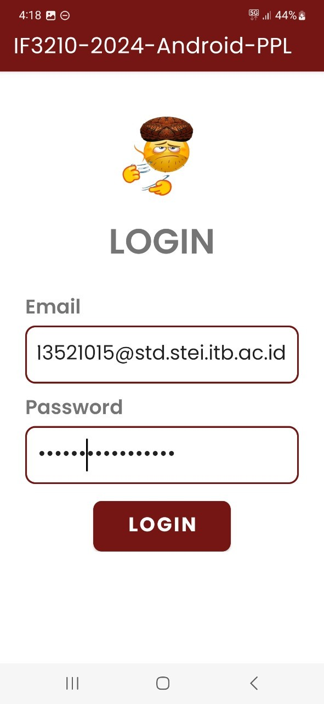
  <!-- add login image from screenshot folder -->
- transaction 
- 
- add transaction 
- 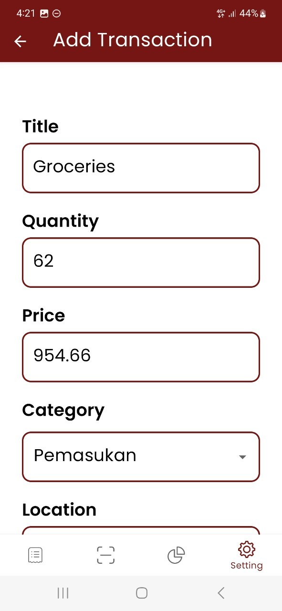
- graph 
- 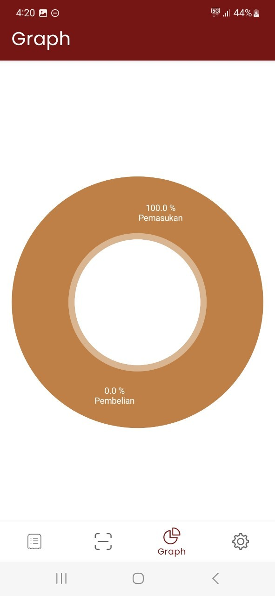
- scan Bill 
- 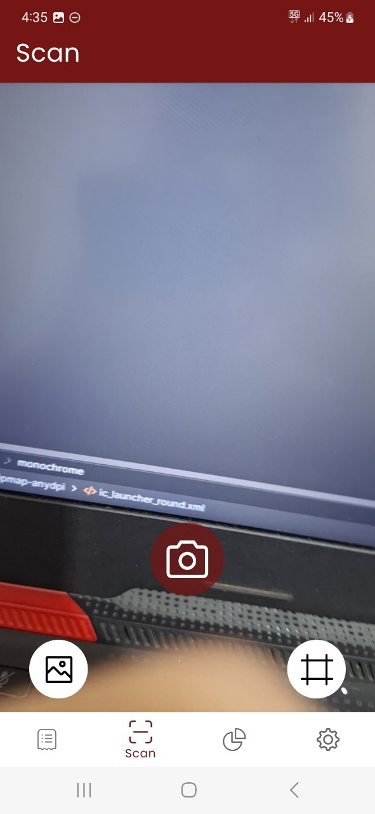
- add transaction from bill 
- 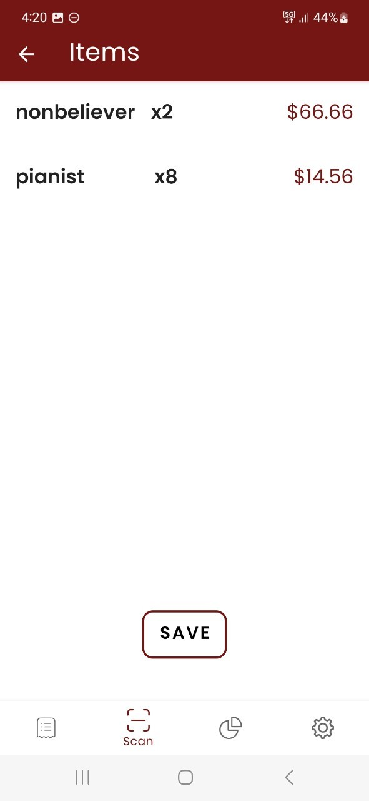
- something went wrong 
- 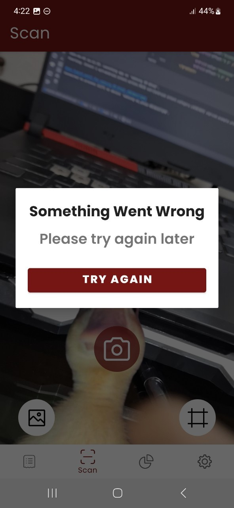
- twibbon 
- 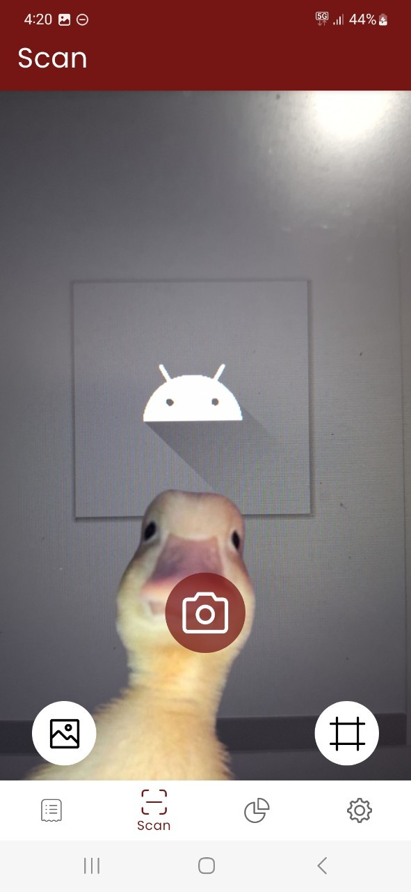
- setting 
- 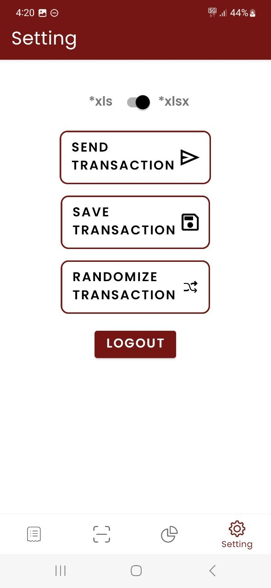
- no network 
- 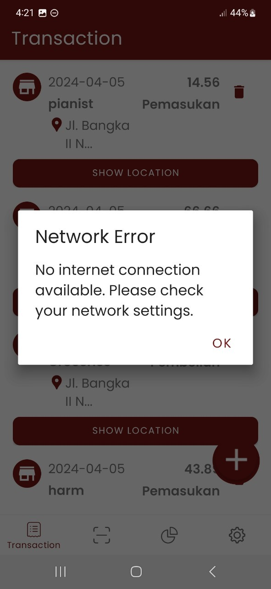
- save to excel 
- 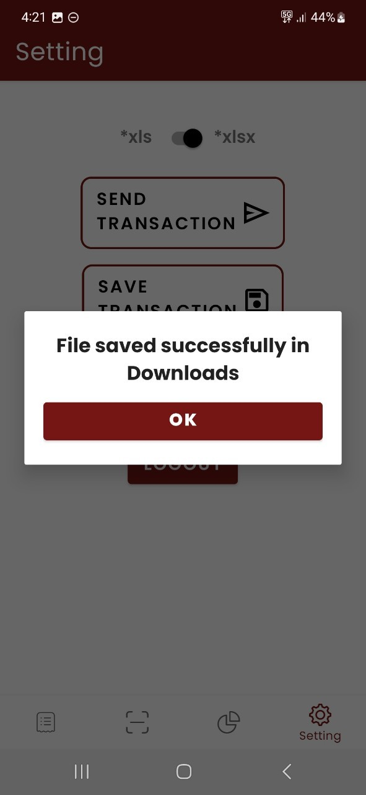
- send to email 
- 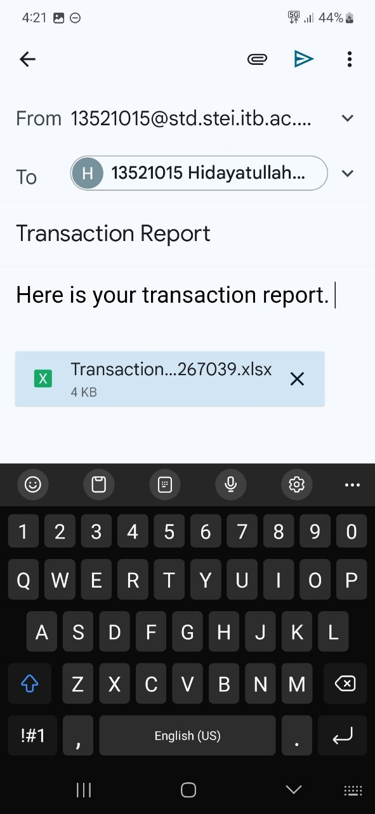
- jwt expired 
- 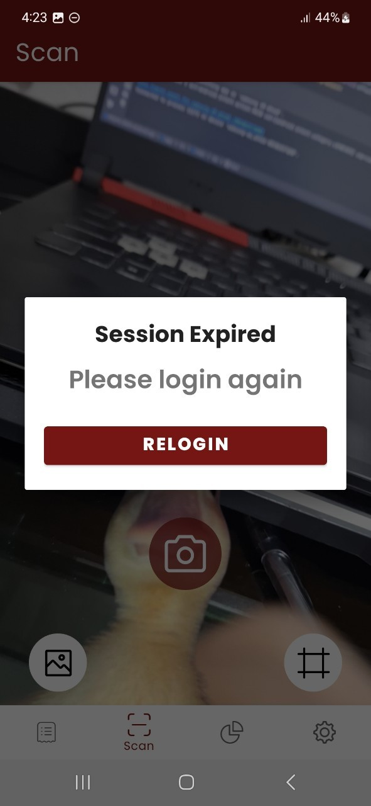

## Pembagian kerja 
- 13521015 - Hidayatullah Wildan Ghaly B (+-25 jam kerja & +-6 jam persiapan)
  - Membuat fitur login
  - Membuat fitur jwt expired
  - Membuat fitur setting
  - Membuat fitur bill
- 13521018 -  Syarifa Dwi Purnamasari (+-25 jam kerja & +-6 jam persiapan)
  - Transaction list
  - CRUD transaction
  - Randomize transaction
  - Graph
- 13521022 - Raditya Naufal Abiyu (+-25 jam kerja & +-6 jam persiapan)
  - Fitur scan bill
  - Fitur Twibbon
  - Network sensing
